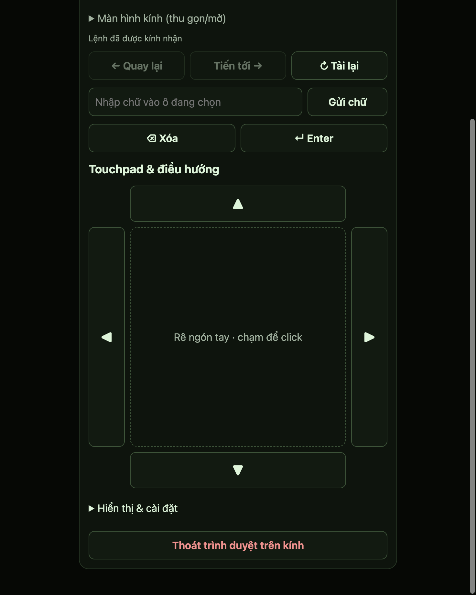
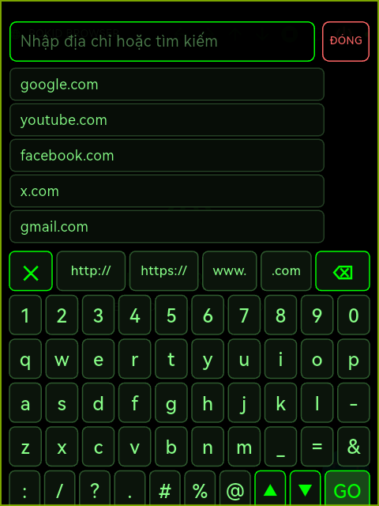
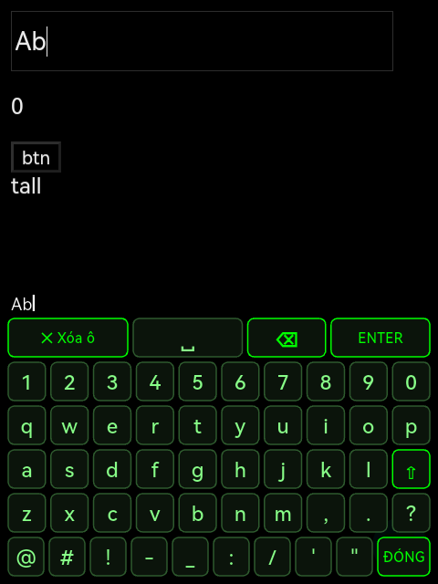
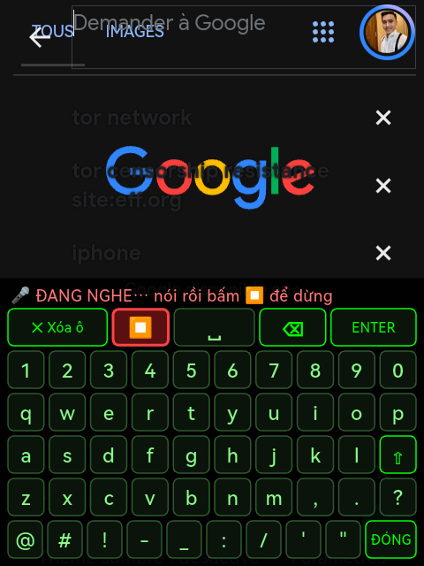
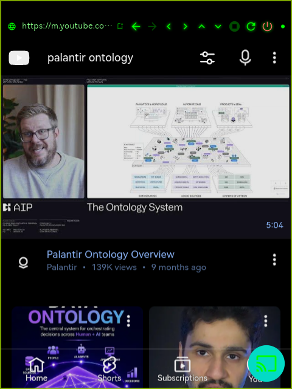
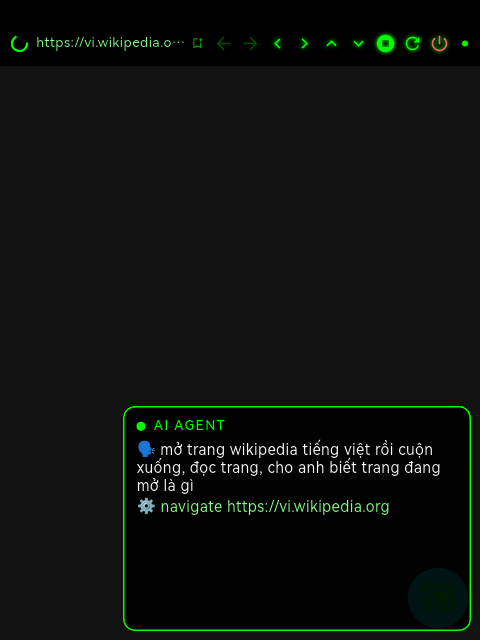

# Rokid Glass Browser

A standalone web browser for **Rokid AI Glasses (RV101, Android 12)** that you drive from any phone's web browser over Wi‑Fi — no companion app to install, no Bluetooth pairing, no cloud.

The glasses run the browser **and** host a tiny web page. Open that page on your phone (same Wi‑Fi) and you get a live view of what the glasses show, a touchpad, and all the controls. The glasses' own touchpad and temple button are fully mapped too, so you can browse hands‑free once a page is open.

> Inspired by [Inplov/rokid-browser](https://github.com/Inplov/rokid-browser) (Bluetooth‑paired phone app). This project is a from‑scratch rewrite around a different idea — the glasses serve the remote — and shares no code with it. The hardware‑button technique was learned from [ksuzukigh/rokid-zoom-in-camera](https://github.com/ksuzukigh/rokid-zoom-in-camera). Thanks to both authors.








## What you get

**On the phone (any browser, iOS or Android)**
- Live stream of the glasses display (JPEG, ~5 fps, ACK‑paced) — collapsible so it doesn't eat the screen
- Address bar with search, ✕ clear
- Touchpad: 1 finger = move cursor, tap = click, hold‑then‑drag = drag, 2 fingers drag = scroll, pinch = zoom
- Arrow keys ▲▼◀▶ around the touchpad, Back / Forward / Reload, Enter / Backspace, text input
- Display modes (normal / transparent / wireframe), dimming, text zoom, HUD toggle
- **Exit browser on glasses** button
- **Agent log** (expand under the command box): every run's steps — tool, arguments, duration, result — so prompts and tools can be tuned from real data; Copy JSON to share it
- **History** section (expand at the bottom): search, open, delete one, or clear all
- Auto‑reconnect after reload or a short network drop; one controller at a time; revoke/stop from the glasses

**On the glasses**
- **Floating agent console** (bottom-right, shows while the agent runs): what you said (🗣), the model's thinking (💭), each tool/command it runs (⚙︎) and the final result (✓), auto-scrolling to the newest line
- **AI agent (hold the temple button)**: hold → beep + “AGENT LISTENING”, say what you want, press the button once → the command is transcribed and an agent carries it out with browser tools (navigate / read_page / click / type / press_enter / scroll / back / forward / reload). Works for one-shot commands (“refresh”, “scroll down a bit”) and multi-step ones (“open YouTube and find videos about palantir ontology”). Same agent can be driven from the web remote's command box
- All on-glasses UI is in English
- **Voice input (🎤 on both keyboards)**: tap once → beep + “ĐANG NGHE…”, speak, tap ⏹ → text is recognised by Gemini (default **gemini-3.8-flash** (cheapest); pick any model from the web remote after *Fetch models*) and typed into the field. Needs a Gemini API key saved from the web remote (Settings → *Gemini API key*, stored on the glasses only). The RV101 has no Google Speech, so sites’ own voice search cannot work; this replaces it
- **Microphone for web pages** (YouTube / Google voice search works; permission asked once on first launch)
- Page content is laid out **below** the address bar (no more fixed headers hidden under it — e.g. the YouTube search button)
- **Wi‑Fi auto-on** when the app opens (also persists Rokid's own Wi‑Fi preference so it survives reboot — technique from [rokid-wifi-on](https://github.com/ksuzukigh/rokid-wifi-on))
- **URL keyboard** (click the address bar): QWERTY + digits + `: / ? . # % @`, `http://` `https://` `www.` `.com`, ✕ clear, GO — big keys for the 2‑axis cursor. Autocomplete from your history and popular services (root domains first, deep paths after), ▲▼ to pick, ✕ to forget an entry
- **Text keyboard**: click any input on a page and a compact keyboard slides up (letters, digits, symbols, ⇧, ␣, ⌫, **✕ Xóa ô** clears the field, ENTER submits). Clicking the page hides it, like a phone
- **Mouse mode double-tap** on the touchpad = double-click at the cursor
- Toolbar next to the address bar: ◀ ▶ history, ‹ › ˄ ˅ send arrow keys to the page, ■ stop, ↻ reload, ⏻ exit — all clickable with the cursor: ◀ ▶ ▲ ▼ ■ ↻ ⏻ — click them with the cursor
- Two modes, toggled with the temple button: **MOUSE** (swipe moves the cursor, tap clicks) and **SCROLL** (swipe scrolls / jumps between elements, tap activates)
- Smooth cursor glide with acceleration on repeated swipes; cursor stays visible in mouse mode
- Element‑jump starts from the first element currently on screen, not the top of the page

## Controls on the glasses

| Input | Mouse mode | Scroll mode |
|---|---|---|
| Swipe forward / back on touchpad | Move cursor (axis set by button) | Scroll page ⅓ screen / next‑prev element |
| Tap 1 finger | Click at cursor | Activate focused element |
| Double‑tap 1 finger | ignored | Back |
| Temple button ×1 | Flip cursor axis ↔ / ↕ | (shows current mode) |
| Temple button ×2 | Switch MOUSE ↔ SCROLL (pill shows the mode) | same |
| Temple button hold ~1 s | Exit browser (second hold or ⏻ confirms) | same |

While the browser is in the foreground it asks the Rokid system to disable the button's photo/video actions, and restores them when you leave — same mechanism as rokid‑zoom‑in‑camera. Two‑finger gestures and one‑finger hold are owned by the Rokid system (volume, AI assistant) and cannot be remapped by an app; see `docs/gesture-lab/README.md` for the full measured gesture table.

## Install

Requirements: Rokid RV101 with developer mode (ADB) enabled and the 5‑pin debug cable, or install the APK through Hi Rokid → Toolbox → Glasses app management.

```bash
adb install -r releases/rokid-glass-browser-1.18.1.apk
```

## Use

1. Put the glasses and your phone on the same Wi‑Fi.
2. Open the browser on the glasses → tap the **Web Remote** button (bottom‑right) → **BẮT ĐẦU WEB REMOTE**.
3. The glasses show an address like `http://192.168.1.x:NNNNN`. Open it on your phone. That's it — no code to type.
4. To cut the phone off: **THU HỒI** (revoke) or **DỪNG** (stop) on the glasses.

The port is random per start and the server only listens on the LAN interface; it is not reachable from the Internet. Only one phone can control at a time.

## Build from source

```bash
cd glasses_app
flutter pub get
JAVA_HOME=<JDK 17> flutter build apk --release --target-platform android-arm64
```

Tested with Flutter 3.x / Dart 3.11, JDK 17. `flutter test` covers the local server (auth, origin/host checks, one‑controller, frame ACK/backpressure, reconnect grace, revoke/stop).

## Repository layout

```
glasses_app/   Flutter + Kotlin app that runs on the glasses (browser + web remote server)
docs/          Gesture lab measurements and RV101 input research
releases/      Signed release APKs
```

## Known limits

- Stream is JPEG over WebSocket, capped at 5 fps — fine for navigation, not for watching video on the phone.
- Two‑finger double‑tap on the touchpad is recognised by the firmware only ~40% of the time; it is used only as a Web Remote panel toggle.
- The phone page has been tested in Chromium‑based browsers and iOS Safari for pairing/stream/control; if something misbehaves on your browser, open an issue with the browser name.

## License

MIT
